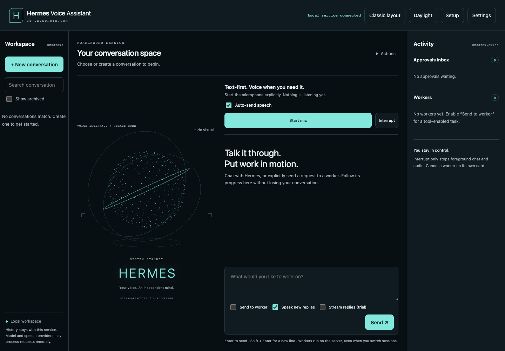
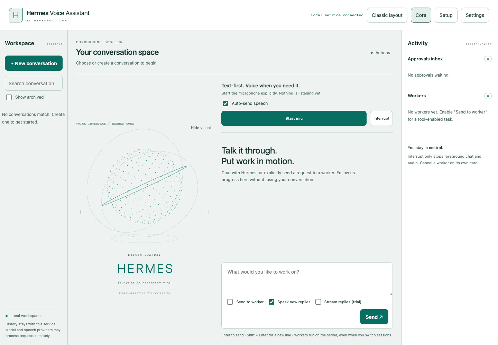
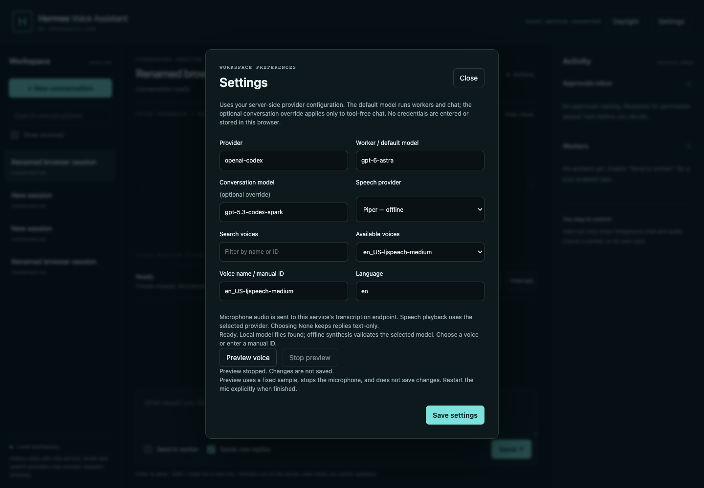
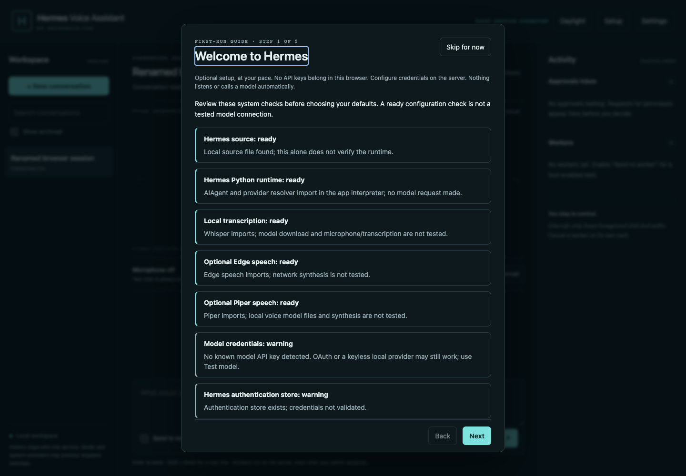

# Hermes Voice Assistant by Devsdroid.com

**A local-first AI voice assistant and web dashboard for Hermes Agent, with multiple conversations, speech-to-text, text-to-speech and background AI tasks.**

Local alpha `0.1.0a1`. Working software, not yet a production release or a published open-source repository. Community project; not an official Nous Research product. Original dashboard code is MIT-licensed; dependency and voice-model licenses are separate. Publication approval is still pending.

[Installation](docs/installation.md) · [Alpha release notes](docs/releases/0.1.0a1.md) · [Contributing](CONTRIBUTING.md) · [Security](SECURITY.md)

## Screenshots

Actual alpha interface, captured using a separate empty-session service with no private conversation data.

### Studio / Core: voice beside the conversation


### Studio / Daylight: a calmer light workspace


Studio is the default. **Classic layout** restores the previous workspace immediately. See the [Studio guide](docs/studio.md).

### Voice settings: search, preview and offline speech


### First-run setup: checks before configuration


## What works today

- **Guided setup:** first-run checks, explicit model connection test, model/voice choices, microphone level and speaker tests, verified settings save and a reopenable dashboard tour. See [setup guide](docs/setup.md).
- **Multiple sessions:** create, switch, rename, search titles, archive, delete inactive sessions and export JSON.
- **Server-owned tasks:** a worker continues while you switch conversations or reconnect your browser. Server restart marks unfinished work interrupted instead of silently rerunning actions.
- **Separate chat and worker roles:** use one configured model, or an optional conversation-model override. Send tool-enabled requests explicitly with **Send to worker**.
- **Voice conversation:** manually start the microphone, transcribe locally with Whisper, optionally auto-send speech to tool-free chat, and speak new replies with the selected provider.
- **Chunked speech playback:** bounded chunks and one-chunk prefetch after the completed reply, abortable synthesis and reusable local voice engines. See [measurements and limits](docs/voice-latency.md).
- **Early-speech trial (off by default):** opt-in provisional text and sentence-ready speech for tool-free chat. No useful early-audio latency benefit was demonstrated on the tested runtime; this is not a proven token-streaming speedup. See [trial results and reversibility](docs/early-speech.md).
- **Explicit voice-to-tool confirmation:** with Send to worker enabled, speech is staged in the composer for review and manual sending rather than automatically executing tools.
- **Speech choices:** Edge, ElevenLabs, OpenAI TTS or optional offline Piper; searchable voice lists, manual IDs and preview-before-save. Text-only remains the default. See [voice setup and licensing](docs/voice-providers.md).
- **Studio workspace, Core and Daylight themes:** voice beside the conversation, a projected 3D core driven by measured microphone/playback energy, real listening/thinking/speaking states, Hide visual to reclaim reading space, and immediate Classic fallback. Responsive controls and reduced-motion support.
- **Task controls:** actual worker results, cancellation and session-bound approval requests.
- **Local history:** SQLite records in the dashboard data directory; no provider keys in the browser.

## Quick start

Requires Python 3.11 or newer. From this project’s source directory, use an environment where your supported Hermes installation already works, then install the dashboard there:

```sh
python -m pip install -e ".[speech]"
hermes-voice
```

Open **http://127.0.0.1:8780**. Create a conversation, check Settings and choose text or voice. The package is not currently published to PyPI; `pip install hermes-voice` is not the documented installation path.

Hermes itself is not a normal published wheel dependency. An existing checkout path alone does not supply its Python dependencies. See the [installation guide](docs/installation.md) and the official [Hermes Python library documentation](https://hermes-agent.nousresearch.com/docs/guides/python-library).

On the prepared local macOS workspace, double-click **Start Hermes Voice.command**. Keep the Terminal open; Control+C stops the server. It never starts at login or activates the microphone automatically.

## Using sessions and tasks

1. Create a session and give it a useful title.
2. Chat normally, or enable **Send to worker** for a tool-enabled task.
3. Switch to another session while work continues.
4. Return to inspect the actual result or use **Read result**.
5. Use **Interrupt** for foreground chat/audio, or **Cancel worker** for the task itself.

Only the selected session owns microphone/audio playback. Old replies are not replayed when switching sessions. Background notifications are client-local in this alpha. Worker completion is not independent proof that every requested goal succeeded; inspect the result and its qualifications.

## Privacy and safety

The UI is local, but configured cloud models receive conversation text and selected cloud TTS providers receive reply text. Local-first does not mean fully offline. See [Privacy](docs/privacy.md) and [Security](SECURITY.md).

This is a single local user's application, not authenticated multi-user hosting. Keep it bound to loopback. Do not expose it through public tunnels. Hermes tools may access the filesystem with your permissions; this dashboard is not a sandbox. Cancellation cannot undo completed side effects.

## Verified so far

See the [release verification record](docs/release-verification.md) and [third-party notices](THIRD_PARTY_NOTICES.md) for scope and unresolved gates.

Latest recorded local regression results: **100 Python tests, 55 browser tests and 18 Node speech/geometry tests passed**. These are local development results, not remote CI badges or platform certification.

- Deterministic backend regression tests: persistence, session isolation, overlapping lanes, approvals, cancellation, static asset routing and exception privacy.
- Live provider checks: independent session context, a real tool task in one session while chatting in another, reconnect without duplicate work, cancellation and export.
- Browser checks: session switching/rename, settings, theme persistence, mobile overflow and JavaScript errors.
- Prerecorded synthetic microphone -> local Whisper -> configured conversation model -> Edge TTS -> actual browser playback; microphone tracks release on session switch.
- Python lint/format checks, source/wheel builds, and clean macOS Python 3.12 wheel installation for UI/storage with Hermes absent.

Live Hermes inference was tested on macOS in a Hermes-enabled Python 3.11 environment against installed Hermes revision `21b2095d00`. A clean macOS Python 3.12 wheel check covered UI/storage with Hermes absent, **not a full independent Hermes installation**. Remote CI and Windows/Linux execution remain unverified. Synthetic audio tests do not establish real-room microphone quality.

## Known alpha limitations

- No automatic conversation-to-worker routing yet; dispatch is explicit.
- Default replies wait for model completion. The default-off [early-speech trial](docs/early-speech.md) has no demonstrated early-audio advantage on the tested runtime; native realtime audio is not implemented.
- No full-duplex barge-in, wake word or remote hosting.
- No automatic dependency installer/profile switcher, durable approval recovery, task steering or artifact download service yet.
- Speech is chunked into bounded requests; long replies can make multiple provider calls. Text stays readable/exportable when speech fails.
- UI/session polling and storage still need pagination and load testing before large histories.
- Provider/runtime failures are deliberately redacted. A richer safe diagnostic interface remains planned.
- History is retained locally; onboarding retention controls and stronger deletion UX are pending.

## Development

See [Contributing](CONTRIBUTING.md) for deterministic test commands, isolated browser setup and live-provider testing boundaries. Review [architecture](docs/architecture.md) before changing session, task or audio ownership.

## Roadmap

Next: broader installation compatibility, stronger session/task recovery, artifact handling, voice latency and accessibility review. Then optional themes, safe task steering, wake word and native realtime adapters. See [architecture](docs/architecture.md) and the [public-release checklist](docs/release-checklist.md).

## FAQ

**Does this require a specific GPT model or ElevenLabs account?** No model is hardcoded as a mandatory default. The dashboard reads configured Hermes model/provider preferences; voice is optional. Compatibility still depends on the tested Hermes adapter and provider capabilities.

**Can I keep talking while an AI task runs?** Yes. Explicit worker tasks run independently of chat and remain attached to their session.

**Does refreshing the browser restart my task?** No. Work belongs to the running server. A server restart is different and interrupts uncertain in-flight work rather than repeating actions.

**Is it fully offline?** Not by default. Whisper transcribes locally; optional Piper can synthesize locally after model installation. Cloud models and cloud TTS still send text to their providers. A fully local model setup needs its own compatibility validation.

**Is this a realtime voice assistant?** It supports turn-based voice conversation, not full-duplex speech or wake-word listening. The early-speech trial is off by default and has no proven latency benefit on the tested runtime.

**Does it work on Windows or Linux?** Those platforms have not been exercised yet. The recorded runtime and browser checks are on macOS; a platform-neutral CLI is not proof of cross-platform support.

**Is this official Hermes software?** No. It is an independent community project by Devsdroid.com, not an official Nous Research product. Original dashboard code uses the [MIT License](LICENSE); dependencies and voice models retain their separate licenses. Publication is not yet authorized.

**Is this production-ready?** Not yet. This alpha has real execution evidence, but platform, load, security, dependency-attribution and publication gates remain.
